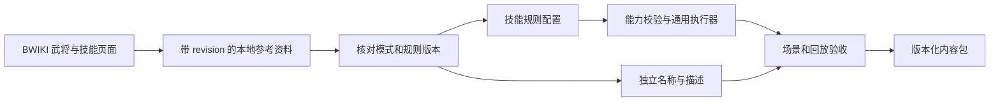

# BWIKI 资料与技能执行模型对齐

2026-09-20。本文约束后续机制设计和内容迁移；不是可执行 JSON schema，也不代表下面的所有触发能力已经实现。当前执行边界分别见 [RUNTIME_V1.md](RUNTIME_V1.md) 至 [RUNTIME_V10.md](RUNTIME_V10.md)。

## 资料进入游戏的路径

抓取成功只表示资料已保存。页面标题、中文描述、分类标签不能直接执行，也不能自动成为正式选将池。正式迁移至少固定站点、页面、revision、模式、技能版本及历史版本标识；同名技能和同一页面内多个版本分别核对。

资料库见 [BWIKI_REFERENCE_DATA.md](../BWIKI_REFERENCE_DATA.md)，具体内容队列见 [BWIKI_CONTENT_BACKLOG.md](../BWIKI_CONTENT_BACKLOG.md)。本站 `/sgs/` 与另站 `/sgsol/`、`/msgs/` 的资料不自动合并。参考页可能同时有旧 FAQ 与新描述，冲突应进入待核对清单。

## 概念分别落在哪一层

以下是对[技能概念介绍，revision 78953](https://wiki.biligame.com/sgs/index.php?title=技能概念介绍&oldid=78953)的工程映射；字段名表达设计意图，尚未加入 v1 加载器。

| 资料概念 | 执行契约 | 需要防止的误用 |
| --- | --- | --- |
| 主公、锁定、限定、觉醒等标签 | 展示标签、拥有者资格、发动政策、使用账本分别定义 | 仅靠标签推导能否发动、强制性或优先级 |
| 状态技／触发技 | 修正查询与事件绑定可以同属一个技能 | 一种互斥枚举代表整个技能 |
| 限定／觉醒 | 按角色与技能身份记录整局状态，规定获得／失去后的处理 | 用每回合次数代替整局次数 |
| 阴阳转换技 | 初始状态、状态分支、切换提交点和可见性 | 与实体牌转换成杀／闪的 `viewAs` 混为一谈 |
| 额定摸牌数 | 正常摸牌阶段的数量查询 | 所有 `draw` 操作都叠加英姿类修正 |
| 使用／打出牌 | 明确动作语义、有效牌型、实体成本和转换技能来源 | 只看最终牌型就认定发动过龙胆 |
| 判定 | 改判窗口、最终结果、结果后效果、原判定收尾 | 中间判定牌提前触发最终结果效果 |
| 技能失效／拥有者死亡 | 分别规定新候选资格与已开始效果的续接 | 全局清空已开始的结算帧 |

## 结算生命周期

完整触发运行时需要保存“已收集、已发动、已支付、等待子流程、已完成”的边界。状态查询在技能失效后重算；尚未发动的候选重检资格；已经发动的效果依据所选规则集和明确的继续政策续接。死亡触发还需要允许已死拥有者作出选择、处理直接死亡与嵌套死亡，并在模式规定的时点检查胜负。

v1 主动步骤目前在拥有者死亡后取消剩余效果。这是 `skill-program-v1` 的既定行为，不能当成完整技能规则，也不能在原版本中悄悄改变。新增通用生命周期能力时应提升执行语义版本，保留旧存档和回放路径。

## 下一个机制批次

| 顺序 | 当前任务实现的通用能力 | 内容任务提供的第一组场景 |
| --- | --- | --- |
| 1（已完成） | 使用／响应的转换来源与对抗上下文、可暂停触发绑定、获取目标暗手牌 | SP 赵云：龙胆／冲阵；普通杀闪不误触发；响应和主动使用分别验收 |
| 2a（已完成） | 最终判定结果冻结、花色／点数／原因过滤、可选回复与摸牌、父判定续接 | 受控刚烈判定：改判后的最终牌、跳过／发动、回复上限、判定牌收尾和 Replay |
| 2b（已完成） | 改判选牌、显式旧牌去向、替换提交后的花色／点数效果、原判定续接 | 受控双绑定场景：旧牌进手／弃置、装备区成本、黑桃 2～9 摸牌、连续改判与 Replay |
| 2c（已完成） | 按最终结果选目标、类型化伤害及伤害／濒死子流程续接；强制回复与可选伤害分属独立绑定 | 受控刚烈判定中的梅花回复／雷伤：私有选目标、伪造拒绝、目标阵亡、外层伤害技能续接与 Replay |
| 2d（已完成） | 由精确使用／打出牌动作发起自身判定，并保留父用牌流程 | 受控绑定 A：实体闪响应、闪电使用、自己判定、原响应弃牌与延时牌置入续接；正式界张角已在 A52 注册 |
| 3（已完成） | 伤害粒度、标记作用域、死亡技能窗口、直接死亡和胜负时点 | 神关羽武魂；D4a～D4c 完成通用能力，A53b2 已以正式内容和真实经典牌堆验收致死伤害、并列最高、全零、判桃与嵌套死亡 |
| 并行内容批次 | 使用 v1 已有修正、转换和主动步骤，不新增执行器分支 | 小型组合示例、描述对齐、选牌／选人交互和存档场景 |

武魂的当前页面与“正式服 I 版”包含不同的加标记条件；设计中的“受伤后加梦魇”示例只代表明确选择的旧版本语义，不是所有版本的统一描述。武将体力和技能绑定也要跟随同一版本证据，不能只按武将名称匹配。

D2 的具体场景见 [SP 赵云迁移规格](../generals/SP_ZHAO_YUN.md)。使用／响应动作需要保留稳定动作 ID、转换绑定和技能实例、实际使用者／提供者／请求者、对抗角色及最终目标快照；多目标、无双与决斗多轮分别保存候选游标和父动作，不能共用一个技能专属 pending 槽位。同语义龙胆可复用同一程序，监听来源由配置和实例身份确定，不要求按武将复制实现。转换链用于记录来源，不自动授权二次牌型转化；这类合法性与先后顺序须由选定版本及独立场景核对。

D3a 已在 rules 81／schema 3 增加改判之后、判定牌收尾之前的 `judgmentFinalized`，并以受控刚烈判定验证回复／摸牌后恢复原伤害技能流程。D3b 又在 rules 82／schema 4 增加 `judgmentReplacing`：手牌／装备精确成本、旧牌进手或弃置政策、替换提交花色／点数条件以及与既有鬼才／鬼道共用的稳定游标都已受控回归。BWIKI 的通用判定术语写明普通更换时原牌入弃牌堆，当前三国杀 OL 界张角页及 2019 上线公告也未写获得旧牌，因此正式当前界鬼道使用 `discardPile`；`ownerHand` 仅代表显式自定义或另行核实的历史变体。D3c 已在 rules 83／schema 5 增加最终判定后的私有目标选择与类型化伤害，并验证嵌套濒死、死亡、外层刚烈伤害技能和 Replay 的精确续接；梅花强制回复与可选伤害使用两个绑定，不能共用一个 `optional`。D3d 已在 rules 84／schema 6 增加直接 `cardKinds` 动作过滤和 `startJudgment`：实体闪响应与闪电使用均可暂停发起自己的判定，完成最终结果订阅后再恢复原动作；直接有效牌型与精确转换来源仍为互斥契约。A52 已把这些能力组合成正式界张角；纠错期望仍固定规则来源和版本，与等价迁移分开，旧回放保留旧行为。内容任务所引的金山云 FAQ PDF 首页注明为 2009–2010 年水木社区整理稿，只作历史交叉参考；规则集转载页也要标明转载出处，不能据此宣称所有版本均已确认。

D3e 已在 rules 85／schema 7 增加 `contributions`。这条能力不把主公技标签当成主动技执行器：程序仍属于当前存活且身份符合的技能拥有者，实际入口属于其他符合势力条件的当前出牌角色。实体牌名与花色按并集过滤，因此经典黄天“闪或闪电”和界黄天“闪或黑桃”只改变配置；使用账本绑定提供者、技能拥有者、程序和贡献 ID，并在提供者进入新出牌阶段时清理。A51／A52 已分别用该能力注册两版黄天。

D3f 已在 rules 86／schema 8 增加卡牌动作窗口的 `selectTarget` 和 `startJudgment.target:selectedTarget`，并在 `judgmentFinalized` 增加判定发起者、稳定原因白名单及 `judgmentSubject` 直达伤害。经典雷击因此严格保持“发动后先选另一角色，该角色判定，再按最终花色对同一角色结算”的顺序；另一名拥有相同订阅程序的角色不会误接这次判定。目标 Choice、判定、伤害和原闪响应均沿通用帧续接，不新增张角专用页面或流程。

D3g 在 rules 87 修正多人改判的通用候选起点：同一时机从当前回合角色开始按行动顺序冻结类型化与配置化候选，而不是从判定主体开始。rules 86 及更早继续旧路径；同一暂停点的新旧规则对照与候选游标 Replay 已验证版本边界。此项是基础判定规则修正，不提升 schema 8，也不改变已有程序玩法哈希。

D3h 在 rules 88 修正改判支付牌与判定来源装备的冲突：判定主体装备区里正在产生本次八卦判定的【八卦阵】不进入鬼道类候选，其他黑色手牌／装备仍可使用。类型化和配置化路径共用同一保护，rules 87 保留旧候选；同一八卦响应暂停点的新旧 Prompt 与 Replay 已直接对照。此项不改变 schema 4／8 或程序玩法哈希。

A51 已在 `standard-classic-generals@1.65.0` 把经典雷击、鬼道和黄天整体切换为 schema 8 程序。三个程序都显式要求 rules 88：雷击保持“有效闪后可发动、先选另一角色、该角色判定”的触发链；鬼道以 `ownerHand` 固定经典替换术语对应的旧牌取得，并继承从当前回合角色排序和八卦来源装备保护；黄天仍由其他群势力角色从自己的出牌阶段入口交出手牌。1.64.0 及更早继续沿原类型化路径，未改写旧内容哈希。

A52 已在 `standard-classic-generals@1.66.0` 以 `boundary:*` 独立注册界雷击、界鬼道和界黄天，并新增五人／八人界限突破模式；经典模式不含界张角，1.65.0 也不含任何界将定义。界雷击复用本人判定与最终结果订阅，界鬼道使用 `discardPile` 并只在提交黑桃 2～9 时摸牌，界黄天按“闪或黑桃手牌”并集筛选。正式场景与 Replay、模式隔离、来源快照和 WPF 卡面均已通过。

A53b2 已在 `standard-classic-generals@1.67.0` 注册正式服 I 版神关羽。武神由 schema 10 的持续红桃手牌身份与来源限定杀距离表达，显式要求 rules v95；武魂只以 `SkillKind.Wuhun` 声明通用死亡技能消费者所有权，复用 D4 的梦魇来源账本、死亡终局门、判定、直接死亡与清理栈。两者都带锁定技文案，但没有从“锁定技”标签推导统一优先级或询问政策。真实经典牌堆已覆盖红桃桃按杀、濒死无桃入口和武魂整链 Replay；1.66.0 与界限突破试验池不含神关羽。

## 协作交付边界

本任务维护通用 schema、执行器、规则版本和兼容性。**三国杀持续迭代：规则、武将与完整体验**（`01a0b411-5305-7e52-876f-bc8318c4f0cb`）维护具体武将版本、技能配置、独立描述、头像来源和验收清单。

内容任务遇到能力缺口时提交：来源 revision、选用版本、最小输入场景、期望的事件／牌区／下一询问、已有能力为何不足。通用任务把缺口实现为可复用行为，再由内容任务按批迁移。不得用技能名称分支绕过组合层，也不得把未实现的描述标成可玩内容。

## 图像来源

张角、神关羽、SP 赵云的头像和经典形象记录在 [bwiki-portraits.json](../bwiki-portraits.json)，保留文件页、原图地址、下载时间、尺寸和 SHA-256。外部素材不属于项目原创图像；下载素材不等于相应武将规则已经接入。普通赵云与 SP 赵云使用不同资源键。
