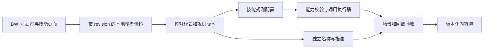

# BWIKI 资料与技能执行模型对齐

2026-09-20。本文约束后续机制设计和内容迁移；不是可执行 JSON schema，也不代表下面的触发能力已经实现。当前运行时能力仍以 [RUNTIME_V1.md](RUNTIME_V1.md) 为准。

## 资料进入游戏的路径

抓取成功只表示资料已保存。页面标题、中文描述、分类标签不能直接执行，也不能自动成为正式选将池。正式迁移至少固定站点、页面、revision、模式、技能版本及历史版本标识；同名技能和同一页面内多个版本分别核对。

资料库见 [BWIKI_REFERENCE_DATA.md](../BWIKI_REFERENCE_DATA.md)，具体内容队列见 [BWIKI_CONTENT_BACKLOG.md](../BWIKI_CONTENT_BACKLOG.md)。本站 `/sgs/` 与另站 `/sgsol/`、`/msgs/` 的资料不自动合并。参考页可能同时有旧 FAQ 与新描述，冲突应进入待核对清单。

## 概念分别落在哪一层

以下是对[技能概念介绍，revision 78953](https://wiki.biligame.com/sgs/index.php?title=技能概念介绍&oldid=78953)的工程映射；字段名表达设计意图，尚未加入 v1 加载器。

| 资料概念 | 执行契约 | 需要防止的误用 |
| --- | --- | --- |
| 主公、锁定、限定、觉醒等标签 | 展示标签、拥有者资格、发动政策、使用账本分别定义 | 仅靠标签推导能否发动、强制性或优先级 |
| 状态技／触发技 | 修正查询与事件绑定可以同属一个技能 | 一种互斥枚举代表整个技能 |
| 限定／觉醒 | 按角色与技能身份记录整局状态，规定获得／失去后的处理 | 用每回合次数代替整局次数 |
| 阴阳转换技 | 初始状态、状态分支、切换提交点和可见性 | 与实体牌转换成杀／闪的 `viewAs` 混为一谈 |
| 额定摸牌数 | 正常摸牌阶段的数量查询 | 所有 `draw` 操作都叠加英姿类修正 |
| 使用／打出牌 | 明确动作语义、有效牌型、实体成本和转换技能来源 | 只看最终牌型就认定发动过龙胆 |
| 判定 | 改判窗口、最终结果、结果后效果、原判定收尾 | 中间判定牌提前触发最终结果效果 |
| 技能失效／拥有者死亡 | 分别规定新候选资格与已开始效果的续接 | 全局清空已开始的结算帧 |

## 结算生命周期

完整触发运行时需要保存“已收集、已发动、已支付、等待子流程、已完成”的边界。状态查询在技能失效后重算；尚未发动的候选重检资格；已经发动的效果依据所选规则集和明确的继续政策续接。死亡触发还需要允许已死拥有者作出选择、处理直接死亡与嵌套死亡，并在模式规定的时点检查胜负。

v1 主动步骤目前在拥有者死亡后取消剩余效果。这是 `skill-program-v1` 的既定行为，不能当成完整技能规则，也不能在原版本中悄悄改变。新增通用生命周期能力时应提升执行语义版本，保留旧存档和回放路径。

## 下一个机制批次

| 顺序 | 当前任务实现的通用能力 | 内容任务提供的第一组场景 |
| --- | --- | --- |
| 1 | 使用／响应的转换来源与对抗上下文、可暂停触发绑定、获取目标暗手牌 | SP 赵云：龙胆／冲阵；普通杀闪不误触发；响应和主动使用分别验收 |
| 2 | 通用判定、改判交换、最终结果订阅、回复后继续伤害 | 张角各版本雷击／鬼道；先固定普通／界／历史版本，满血回复和连续改判分别验收 |
| 3 | 伤害粒度、标记作用域、死亡技能窗口、直接死亡和胜负时点 | 神关羽武魂；致死伤害、并列最高、全零、判桃与嵌套死亡 |
| 并行内容批次 | 使用 v1 已有修正、转换和主动步骤，不新增执行器分支 | 小型组合示例、描述对齐、选牌／选人交互和存档场景 |

武魂的当前页面与“正式服 I 版”包含不同的加标记条件；设计中的“受伤后加梦魇”示例只代表明确选择的旧版本语义，不是所有版本的统一描述。武将体力和技能绑定也要跟随同一版本证据，不能只按武将名称匹配。

D2 的具体场景见 [SP 赵云迁移规格](../generals/SP_ZHAO_YUN.md)。使用／响应动作需要保留稳定动作 ID、转换绑定和技能实例、实际使用者／提供者／请求者、对抗角色及最终目标快照；多目标、无双与决斗多轮分别保存候选游标和父动作，不能共用一个技能专属 pending 槽位。同语义龙胆可复用同一程序，监听来源由配置和实例身份确定，不要求按武将复制实现。转换链用于记录来源，不自动授权二次牌型转化；这类合法性与先后顺序须由选定版本及独立场景核对。

D3 源码审计已确认两处旧路径行为：`ResolveGuicaiChoice` 对鬼才／鬼道均弃置旧判定牌；`CollectJudgmentReplacementCandidates` 从判定目标座位排序。后续分别验证“旧牌交给改判者或弃置”的移动政策，以及从当前回合角色起算的行动顺序政策。纠错期望必须固定规则来源和版本，与等价迁移分开；旧回放保留旧行为。内容任务所引的金山云 FAQ PDF 首页注明为 2009–2010 年水木社区整理稿，只作历史交叉参考；规则集转载页也要标明转载出处，不能据此宣称所有版本均已确认。

## 协作交付边界

本任务维护通用 schema、执行器、规则版本和兼容性。**三国杀持续迭代：规则、武将与完整体验**（`01a0b411-5305-7e52-876f-bc8318c4f0cb`）维护具体武将版本、技能配置、独立描述、头像来源和验收清单。

内容任务遇到能力缺口时提交：来源 revision、选用版本、最小输入场景、期望的事件／牌区／下一询问、已有能力为何不足。通用任务把缺口实现为可复用行为，再由内容任务按批迁移。不得用技能名称分支绕过组合层，也不得把未实现的描述标成可玩内容。

## 图像来源

张角、神关羽、SP 赵云的头像和经典形象记录在 [bwiki-portraits.json](../bwiki-portraits.json)，保留文件页、原图地址、下载时间、尺寸和 SHA-256。外部素材不属于项目原创图像；下载素材不等于相应武将规则已经接入。普通赵云与 SP 赵云使用不同资源键。
